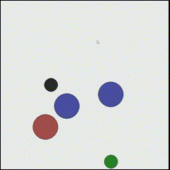
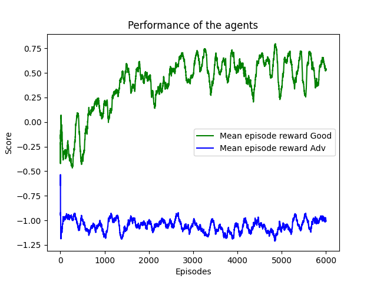

# Multi-agent Deep Deterministic Policy Gradient (MADDPG)

**Trained Agents**
 

## Pettingzoo MPE environment for multi-agent RL
This repository is an example of Multi-agent Deep Deterministic Policy Gradient network architecture with centralised Critic and decentralised Actors. This implementation is fine-tuned for cooperative environment: **Simple Adversary**.  

## The environment - Simple Adversary
In this environment, there is 1 adversary (red), 2 good agents (green), 2 landmarks. All agents observe the position of landmarks and other agents. One landmark is the ‘target landmark’ (colored green). Good agents are rewarded based on how close the closest one of them is to the target landmark, but negatively rewarded based on how close the adversary is to the target landmark. The adversary is rewarded based on distance to the target, but it doesn’t know which landmark is the target landmark. All rewards are unscaled Euclidean distance (see main MPE documentation for average distance). This means good agents have to learn to ‘split up’ and cover all landmarks to deceive the adversary.  
More about the environment: https://pettingzoo.farama.org/environments/mpe/simple_adversary/  

## Environment details
MADDPG Agent action space: [no_action, move_left, move_right, move_down, move_up]  
MADDPG Agent observation space: [self_pos, self_vel, goal_rel_position, landmark_rel_position, other_agent_rel_positions]  
 
DDPG Adversary action space: [no_action, move_left, move_right, move_down, move_up]  
DDPG Adversary observation space: [landmark_rel_position, other_agents_rel_positions]  

## Multi-agent Deep Deterministic Policy Gradient
MADDPG is a modified version of DDPG algorithm, essentially sharing the critic network between all individual agents in the Team. The main difference therefore, that in DDPG we have an Actor-Critic network pair, while in MADDPG we have a n number of Actor networks (n is the number if agents in the game) and a single Critic network that takes as input the states of all agents and the actions of all agents.  
The environment is designed in a way that each agent has its own observation space and action space which are not identical, however the Agents have a common (global) goal to achieve therefore they must work together in order to maximise their individual rewards.  
More about the MADDPG algorithm: https://arxiv.org/pdf/1706.02275.pdf 

## Network architecture
 

## Results and benchmarks
The network was trained for 6000 episodes, and the results are shown below.  
 

The results are benchmarked to DDPG algorithms on the same environment, same hyperparameter setup and same number of episodes. 
 
 

## Notable Hyperparameter
- Learning and weight transfer every 100 episodes
- Episodes training: 6000
- Batch size: 1024
- Learning rate (Actor): 0.01
- Learning rate (Critic): 0.02
- Discount factor (Gamma): 0.95
- weight transfer (Tau): 0.01
- Memory Size: 10**6
- Noise: Ornstein-Uhlenbeck process

I used Leaky RELU activation functions for hidden layers with Softmax activation function for the output layer of the Actor network. The Critic network uses Leaky RELU activation functions for hidden layers with no activation function for the output layer.  

## Prerequisites
* Pettingzoo 
* Numpy
* Tensorflow
* Matplotlib

This network was trained in docker container with the mcr.microsoft.com/devcontainers/python:0-3.10 image.   
 

## Links to research papers and other repositories
Based on OpenAi's research paper: https://arxiv.org/pdf/1706.02275.pdf  
